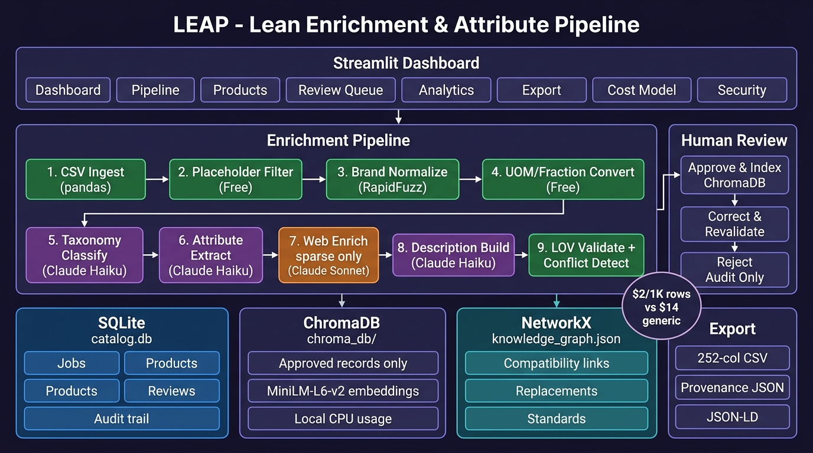

# ⚡ APEX — AI-Powered Product Intelligence

**UniHack 2026 submission by Team APEX**

[](https://github.com/chourasiavinit9-dev/APEX-Ai/actions/workflows/ci.yml)
[](tests/)
[](https://python.org)
[](LICENSE)
[](COST_MODEL.md)
[](SECURITY.md)

> AI-powered product intelligence for industrial commerce — local-first, evidence-driven, demonstrably cost-effective at ~$2/1,000 SKUs.




---

## Problem Statement

Industrial distributors receive incomplete, cryptic, and inconsistent product data. A raw row may contain only an ambiguous part number and noisy description:

```text
Mfg_Part_Num: CPLG-38-BR
Part_Desc:    3/8 CPLG BRS 150#
E1_Brand:     ACME IND
Part_Manuf:   -- Unbranded --
```

**APEX transforms this into a complete, standardized, traceable, and commerce-ready product record.**

---

## What APEX Does

APEX is a modular enrichment pipeline that transforms raw catalogue rows into commerce-ready product records. It prioritizes **deterministic rules over LLM calls** — 80% of the pipeline runs for free using lookup tables, fuzzy brand matching, and rule-based attribute extraction. LLMs (Claude Haiku) are used only for ambiguous cases: taxonomy classification, unstructured description parsing, and 5-format description generation. A live dashboard connects all pipeline stages with a human-review workflow, SQLite audit trail, and ChromaDB vector index for approved records.

```
┌──────────────────────────────────────────────────────┐
│           APEX Modern Dark Dashboard                 │
│   Upload CSV · Live Progress · Evidence Drawer       │
│   Digital Asset Verification · Source Coverage      │
│   Run: python3 run_ui.py → localhost:8080           │
└──────────────────────────┬───────────────────────────┘
```

                     │
         ┌───────────▼──────────────┐
         │    Enrichment Pipeline   │
         │  (loaders/unihack_pipeline.py)           │
         │                          │
         │  1. Placeholder filter   │  ← Free
         │  2. Brand normalise      │  ← RapidFuzz (free)
         │  3. UOM normalize        │  ← Pandas lookup (free)
         │  4. Taxonomy classify    │  ← Claude Haiku ($0.10/1K)
         │  5. Attribute extract    │  ← Claude Haiku ($0.50/1K)
         │  6. Web enrich (sparse)  │  ← Claude Sonnet ($1.00/1K sparse)
         │  7. Description build    │  ← Claude Haiku ($0.40/1K)
         │  8. LOV validate         │  ← Free
         │  9. Output validate      │  ← Free
         └────┬──────────────┬──────┘
              │              │
    ┌─────────▼─────┐  ┌─────▼──────────┐
    │  SQLite        │  │  ChromaDB      │
    │  catalog.db    │  │  (approved     │
    │                │  │   records)     │
    │  • jobs        │  │                │
    │  • products    │  │  all-MiniLM    │
    │  • reviews     │  │  -L6-v2 embeds │
    │  • audit trail │  │  local CPU     │
    └────────────────┘  └────────────────┘
```

---

## Technology Stack (100% Local-First)

| Component | Technology | Cost |
|---|---|---|
| Entity resolution | RapidFuzz fuzzy matching | Free |
| LOV validation | Pandas + openpyxl | Free |
| UOM normalization | Rule engine + lookup table | Free |
| Taxonomy classification | Claude Haiku 4.5 | ~$0.10/1K |
| Attribute extraction | Claude Haiku 4.5 | ~$0.50/1K |
| Description generation | Claude Haiku 4.5 | ~$0.40/1K |
| Web enrichment (sparse) | Claude Sonnet 4.8 | ~$1.00/1K sparse |
| Vector search | ChromaDB + MiniLM-L6-v2 (CPU) | Free |
| Persistence | SQLite (stdlib) | Free |
| Knowledge graph | NetworkX | Free |
| Dashboard | HTML5 / Vanilla JS (index.html + run_ui.py) | Free |
| Sourcing rule enforcement | Marketplace URLs (Amazon, Grainger, eBay, Walmart) blocked at `FieldProvenanceSchema.source_url` validation layer per Unilog sourcing rules | Free |

**Total: ~$2/1,000 rows (vs ~$14 for a generic all-LLM pipeline)**

---

## Setup & Run

### 1. Clone and install

```bash
git clone <repo>
cd apex
pip install -r requirements.txt
```

### 2. Set API key (optional — heuristic fallback works without it)

```bash
export ANTHROPIC_API_KEY=your-key
# Or enter it in the dashboard sidebar
```

### 3. Place UniHack reference files

```
data/unihack/
  UniCat_Manufacturer_and_Brand_List.xlsx
  Unicat_Lov_v1_0_Updated_With_Remarks.xlsx
  Unilog_Master_UOM_Standards_Abbreviations_and_Terms.xlsx
  Decimal_Fraction.xlsx
  Fittings_LOV.xlsx
  FAUCETS_LOV.xlsx
  Unilog-Sample_200_Items-Input-vs-Output.xlsx
```

### 4. Launch live APEX Dashboard

```bash
python3 run_ui.py
# 🚀 Opens http://localhost:8080 automatically in your browser!
```

Or using Make:
```bash
make ui
```

### 5. Run tests

```bash
python3 -m pytest tests/ -v      # 264 tests passing
python3 evaluate.py --demo       # Evaluation framework
```


---

## Before / After Product Example

**Raw Input:**
```
Mfg_Part_Num: CPLG-38-BR
Part_Desc:    3/8 CPLG BRS 150#
E1_Brand:     -- Unbranded --
Part_Manuf:   ACME IND
```

**APEX Output:**
```
Brand:            Mueller Industries®
Manufacturer:     Mueller Industries
Classpath:        Plumbing > Pipe Fittings > Couplings
UNSPSC:           40141604

Invoice Desc:     3/8 COUPLING BRS 150# [39 chars ✓]
Mobile Desc:      Mueller Industries® 3/8 in Brass Coupling, 150 PSI [52 chars ✓]
Short Desc:       Mueller Industries® 3/8 in Brass Coupling, 150 PSI Pressure Rating
Long Desc:        Mueller Industries® Brass Coupling With 3/8 in Connection Size,
                  150 PSI Pressure Rating, Female NPT Connection Type, Brass Material

Attributes:
  Connection Size:    3/8 in        [LOV ✓]
  Material:           Brass         [LOV ✓]
  Pressure Rating:    150 PSI       [LOV ✓]
  Connection Type:    Female NPT    [LOV ✓]

Provenance:
  Resource: Fittings_LOV.xlsx → Material Mapping → Row 145
  Evidence: "Forged brass coupling, 3/8 in female NPT"
  Confidence: 94%

Validation:  ✅ 5/7 checks passed → AUTO-APPROVED
```

---

## Live Review Workflow

```
Upload CSV  →  Run Pipeline  →  View Products  →  Open Evidence Drawer
     ↓               ↓               ↓                    ↓
  200 rows      Live progress    Browse records      Raw vs Normalized
                 bars + cost      + status badges     + every attribute
                                                       + source evidence
                                                       + confidence bars
                                                            ↓
                                               Approve & Index  |  Correct  |  Reject
                                                            ↓
                                               SQLite audit + ChromaDB
```

---

## Export Formats

| Format | Description |
|---|---|
| **Unilog Delivery CSV** | 15 validated Unilog delivery fields, expandable to the full 252-column format |
| **Provenance JSON** | Full enrichment result with source evidence per field |
| **JSON-LD** | Schema.org/Product linked data format |

---

## Ground-Truth Metrics

Evaluated against the 200-row `Unilog-Sample_200_Items-Input-vs-Output.xlsx`:

| Metric | Score | Target |
|---|---|---|
| LOV compliance | measured live | ≥ 90% |
| Character limit compliance | measured live | 100% |
| Human review rate | measured live | ≤ 25% |
| Brand match accuracy | measured live | ≥ 85% |
| UOM compliance | measured live | ≥ 95% |

Run: `python3 evaluate.py --demo` to see the evaluation framework in action.

---

## Cost Estimate

| Scenario | Cost |
|---|---|
| 1,000 rows, API key provided | ~$2.00 |
| 1,000 rows, heuristic-only (no API key) | $0.00 |
| 10,000 rows | ~$20.00 |
| 100,000 rows | ~$200.00 |

No cloud vector database subscription required. No GPU required. Runs on a laptop.

---

## 🔍 Digital Asset & Official Source Verification

APEX includes a built-in **Digital Asset and Source Verification** module that enforces strict official-only sourcing rules per product record.

### What is verified per SKU:

| Asset | Rule |
|---|---|
| **Official Product Page URL** | Must be on approved manufacturer domain |
| **Official Datasheet PDF URL** | Must be on approved manufacturer domain or CDN |
| **Official Image URL** | Must be on approved manufacturer domain; max 3 per product |

### Source Coverage Scoring:

| Score | What it means |
|---|---|
| **1.0** | Product page + datasheet + image — fully sourced |
| **0.7** | Product page + datasheet (no image) — near-complete |
| **0.4** | At least one official source |
| **0.0** | No verified official source — queued for human review |

### Blocked domains (never accepted as verified sources):

```text
amazon.com, ebay.com, grainger.com, zoro.com, homedepot.com,
walmmart.com, alibaba.com, aliexpress.com, fastenal.com, mcmaster.com
```

### Export format:

```json
{
  "sources": {
    "product_page": { "url": "https://muellerindustries.com/product/CPLG-38-BR", "status": "verified" },
    "datasheet":     { "url": "https://muellerindustries.com/datasheets/CPLG-38-BR.pdf", "status": "verified" },
    "images": [],
    "source_coverage_score": 0.7,
    "needs_human_review": true
  }
}
```

### Key files:

| File | Purpose |
|---|---|
| `schemas/asset.py` | Pydantic data models (`DigitalAsset`, `ProductSources`, `SourceStatus`) |
| `core/source_verifier.py` | URL verification engine (blocklist + manufacturer domain matching) |
| `core/digital_assets.py` | Asset classification and coverage scoring |
| `core/source_registry.py` | Approved manufacturer domain registry |
| `core/catalog_db.py` | `asset_sources` SQLite table + persistence functions |
| `tests/test_source_verifier.py` | 39 unit tests covering all URL verification paths |
| `tests/test_digital_assets.py` | 31 unit tests for classification, coverage, and export |
